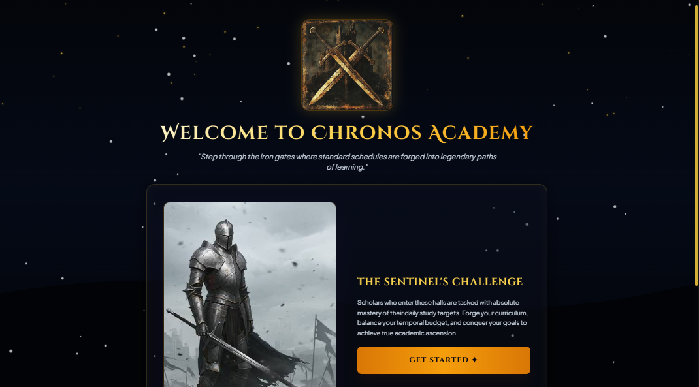
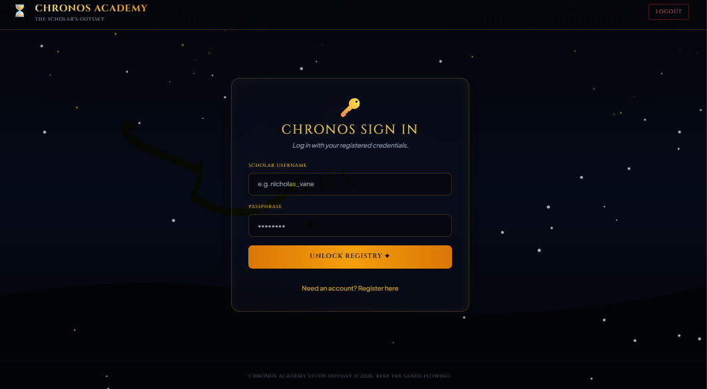
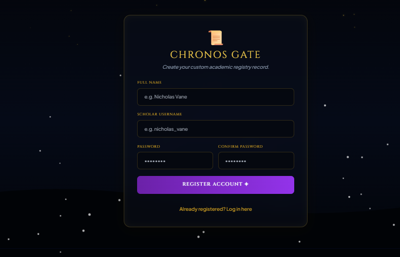
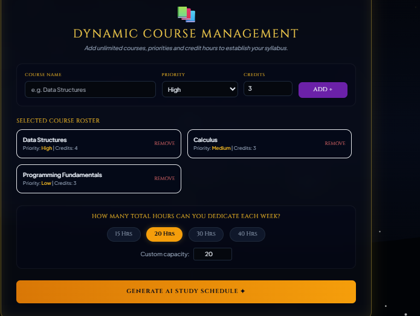
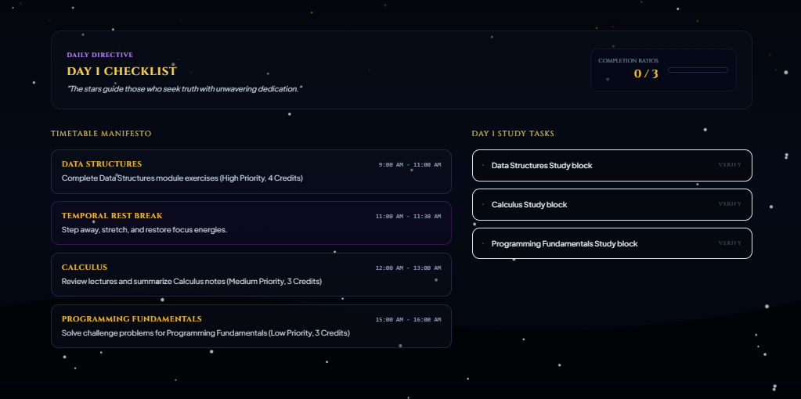
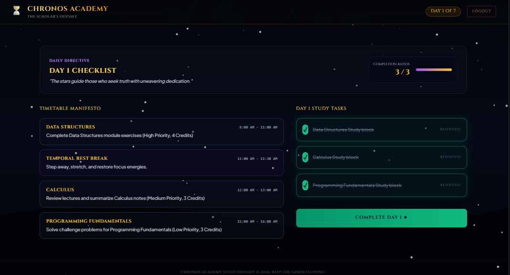
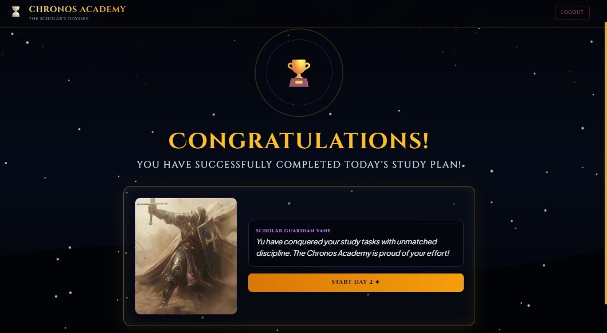

# Chronos Academy: The Scholar's Odyssey

## Project Overview

Chronos Academy is a beautiful fantasy-themed AI study planner that turns studying into an epic heroic journey for young students who love knights, fantasy, and adventure.

## Step-by-Step Working Flow

### 1. Welcome Screen
Beautiful cinematic landing page with crossed swords logo and "Begin Journey" button that welcomes the user into the magical academy.

### 2. Chronos Gate (Login / Register)
Users can create a new account or login with their credentials to access the academy.

### 3. Course Selection
Students add their subjects with priority level and credit hours to build their academic roster.

### 4. Daily Dashboard
Shows the AI-generated timetable and an interactive checklist where users can mark tasks as complete with visual feedback.

After completeing daily tasks user verify each course task

### 5. Congratulations Screen
A grand celebration appears when all tasks of the day are completed, with motivational message and option to proceed to next day.

## Technologies Used

- React 18 (via CDN)
- Tailwind CSS
- HTML5 Canvas API (animated background)
- Web Audio API (sound effects)
- LocalStorage (data persistence)
- Google AI Studio (development)

---

**Made with passion for students who want to study like heroes.**  
**Chronos Academy © 2026**
